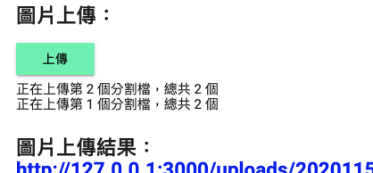

## Express Chunk Upload Example
 [](https://github.com/s890506/Express-Chunk-Upload-Example/blob/master/CONTRIBUTING.md)

基於 axios、express、multer 之檔案分割上傳範例。



## 使用方式

### 1. 安裝相關套件

```bash
npm i
```

或

```bash
yarn
```

### 2. 啟動

```bash
npm start
```

## 參考資料
＊ [https://github.com/postbird/axios-express-chunk-upload](https://github.com/postbird/axios-express-chunk-upload)
